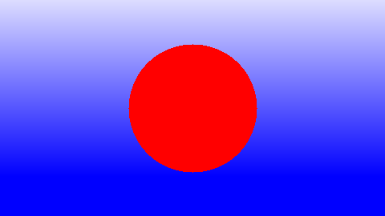

# Aufgabe 1

Diese Datei beinhaltet die Lösung der ersten Aufgabe `a01.md` Computergrafik I.

## Bild




## Lösung

Der Kern der Lösung ist in der Methode `colorForRedSquareOnBlue()` zu sehen. Diese Methode entscheidet
abhängig von der Position des Pixels im Bild, welche Farbe der Pixel erhält.

```java
static int colorForRedCircleOnBlue(int x, int y) {
		
		int rad = 80;
		
		int r = 220;  
		int g = 220;
		int b = 255;
		
	    int x1 = width/2;	
		int y1 = height/2;
		
		
		/* calculate coordinates of centered circle */
		
		if ((Math.sqrt((x1-x)*(x1-x) + (y1-y)*(y1-y))) <= rad  ) 
			
				return new Color(255, 0, 0).getRGB(); 	// set color of circle
		
		else {
				if ((r-y)>0 && (g-y)>0)
						return new Color(r-y, g-y, b).getRGB();  //set background color with gradient 
						
				else
						return new Color(0, 0, b).getRGB();   //r & b can't be negative
			
			}
    }
```

### Kreis

Es wird ein Kreis mit dem Radius 80 Pixel dargestellt. Dazu wird vom Mittelpunbkt des Bildes
ausgehend, ein rechtwinkliges Dreieck "angelegt" und dessen Hypotenuse mittels X- und Y-Wert (Katheten) berechnet.
Falls der berechnete Wert kleiner bzw. gleich dem festgesetztem Radius ist,
wird der Pixel an dieser Stelle *rot* eingefärbt, alle anderen Pixel erhalten die Hintergrundfarbe/n.

### Hintergrund

Der R- und G-Wert (RGB) wird jeweils abhängig vom Y-Wert berechnet. Dadurch ensteht im Hintergrund ein Blauverlauf in vertikaler Richtung.

## Quellen

--
