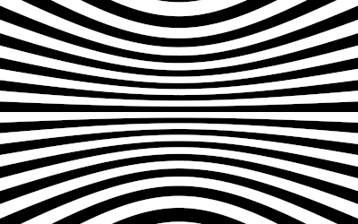

# Abgabe Aufgabe 3: Strahlenerzeugung

Diese Datei enthält die Dokumentation der Lösung von Aufgabe 3: Strahlenerzeugung (Computergrafik I, WS2016) 

## Aufgabe 3.1 Vektoren

Für die geforderten Operationen, wurde jeweils eine Methode in der neuen Klasse  Vec3 implementiert. (siehe Vec3.java) 


### Aufgabe 3.2 Strahl

Die Klassen Point3 und Ray wurden zusätzlich implementiert. Außerdem wurde in der Klasse Ray, die Methode at() definiert, 
die für einen bestimmten Parameter, den Punkt auf dem Strahl berechnet und diesen zurückliefert. (siehe Point3.java, Ray.java)
```java

/**
	 * method searches the position of the point on the ray for given t
	 *
	 * @param value
	 * @return Point3 representing the coordinates of point on ray
	 */
	public Point3 at(final double value) {

		final Point3 result = o.add(d.multi(value));
		return result;
	}


```
## Aufgabe 3.3 Lochkamera

Für die Lochkamera wurde eine neue Klasse Camera mit einer Methode generateRay() erstellt. Die Methode berechnet, für die angegebene Position (x,y) 
eines Pixels im Bild, ein Ray r(x,y) vom Ursprung der Kamera aus, der durch das angegebene Pixel führt. Zusätzlich wurde ein Zoom für die Kamera, mittels zweier Methoden, implementiert

```java
 /**
     * method creates an instance of Ray for given pixel
     *
     * @param width
     * @param height
     * @param x 
		x coordinate of given pixel
     * @param y 
		y coordinate of given pixel
     * @return result
		calculated Ray
     */
	public Ray generateRay(final int width, final int height, final int x, final int y) {
		final Vec3 r = w.multi(-1).multi((height / 2) / Math.tan(angle / 2)).add(u.multi((x - ((width) / 2))))
				.add(v.multi(((height) / 2) - y));
		final Point3 o = e;

		final Ray result = new Ray(o, r.normalized());
		return result;

	}
```

Um die Kamera zu testen wurde in der Main - Methode eine neue Kamera erstellt und mit den gegebenen Testwerten,
die Korrektheit der Kamera überprüft, in dem die Werte Richtungsvektoren der Rays auf der Konsole ausgegeben wurden. 

```java
public class Main {

	static String name = "doc/a02.png";
	private final static int width = 10;
	private final static int height = 10;

	public static void main(String[] args) {

		Camera cam = new Camera(new Point3(0, 0, 0), new Vec3(0, 0, -1), new Vec3(0, 1, 0), Math.PI / 2);
		Ray r_one = cam.generateRay(width, height, 0, 0);
		Ray r_two = cam.generateRay(width, height, 5, 5);
		Ray r_three = cam.generateRay(width, height, 10, 10);
		System.out.println(r_one.toString());
		System.out.println(r_two.toString());
		System.out.println(r_three.toString());

		...
}


```

Ausgabe (Konsole):

Ray [origin=Point3{x=0.0, y=0.0, z=0.0}, direction=Vector3{x=-0.5773502691896257, y=0.5773502691896257, z=-0.5773502691896258}]
Ray [origin=Point3{x=0.0, y=0.0, z=0.0}, direction=Vector3{x=0.0, y=0.0, z=-1.0}]
Ray [origin=Point3{x=0.0, y=0.0, z=0.0}, direction=Vector3{x=0.5773502691896257, y=-0.5773502691896257, z=-0.5773502691896258}]


## Aufgabe 3.4 Hintergrund


## Bild




Der Hintergrund wurde in der Main - Methode, abhängig vom Dy - Wertes des erzeugten Rays, erzeugt.

```java
public static void main(String[] args) {

		Camera cam = new Camera(new Point3(0, 0, 0), new Vec3(0, 0, -1), new Vec3(0, 1, 0), Math.PI / 2);
		BufferedImage im = new BufferedImage(width, height, BufferedImage.TYPE_INT_RGB);
		for (int x = 0; x < width; ++x) {
			for (int y = 0; y < height; ++y) {
				double r = 0;
				double g = 0;
				double b = 0;
				for (int xi = 0; xi < rate; xi++) {
					for (int yi = 0; yi < rate; yi++) {
						double xs = x + (xi + Math.random()) / rate;
						double ys = y + (yi + Math.random()) / rate;

						if ((int) Math.floor(cam.generateRay(width, height,  xs, ys).d.y * p) % 2 == 0) {

							r += 0;
							g += 0;
							b += 0;
						} else {
							r += 255;
							g += 255;
							b += 255;

						}
					}
				}

				int r_e = gammaCorrector(r / (rate * rate));
				int g_e = gammaCorrector(g / (rate * rate));
				int b_e = gammaCorrector(b / (rate * rate));

				im.setRGB(x, y, new Color(r_e, g_e, b_e).getRGB());
			}
		}


```


## Quellen

-Skripte Computergrafik I (WS16)
