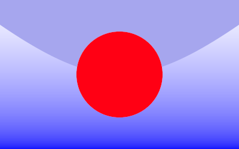

# Aufgabe 4 Strahlschnitte  Computergrafik I (WS16)


## Bild




## Aufgabe 4.1: Strahl, Form und Treffer

Ein neues Interface Shape und eine Klasse Hit wurden implementiert.

(siehe java files in "Shape" - directory)


### Aufgabe 4.2: Strahlschnitt: Hintergrund

Eine neue Klasse Background , welche das Interface Shape implementiert, wurde hinzugefügt.

(siehe java files in "Shape" - directory. Parameter und Methoden sind ausführlich kommentiert)

### Aufgabe 4.3: Strahlschnitt: Kugel

(siehe java files in "Shape" - directory. Parameter und Methoden sind ausführlich kommentiert)

### Aufgabe 4.4: Strahlschnitt: Gruppe von Formen

(siehe java files in "Shape" - directory. Parameter und Methoden sind ausführlich kommentiert.)


### Aufgabe 4.5: Unbeleuchtete Szene

Die Methode raytrace(), dient zur Repräsentation einer Liste (Group) , die beliebig viele Shape - Instanzen besitzt. Dabei wird die Liste überprüft und mithilfe der Methode hit() vom Interface Shape,
überprüft ob die jeweilige Shape - Instanz getroffen wurde, beim Setzten der Pixel. Falls dies zutrifft wird die jeweilige Farbe des Shape - Objektes gesetzt. 


```java

/**
	 * raytracing
	 *
	 */

	private static BufferedImage raytrace(Group group, Camera cam, int rate) {
		BufferedImage im = new BufferedImage(width, height, BufferedImage.TYPE_INT_RGB);
		for (int x = 0; x < width; ++x) {
			for (int y = 0; y < height; ++y) {
				double r = 0;
				double g = 0;
				double b = 0;
				for (int xi = 0; xi < rate; xi++) {
					for (int yi = 0; yi < rate; yi++) {
						double xs = x + (xi + kevin832924.a04.bib.Random.random()) / rate;
						double ys = y + (yi + kevin832924.a04.bib.Random.random()) / rate;

						Hit akt = null;
						for (Shape shape : group.population) {
							Hit i = shape.hit(cam.generateRay(width, height, xs, ys));
							if (i != null)
								if (akt == null || i.t < akt.t)
									akt = i;
						}

						if (akt == null) {

							r += w.backgroundColor.getRed() - (int) ys;
							g += w.backgroundColor.getGreen() - (int) ys;
							b += w.backgroundColor.getBlue();
						} else {

							r += akt.shape.getCol().getRed();
							g += akt.shape.getCol().getGreen();
							b += akt.shape.getCol().getBlue();

						}
					}

				}

				int r_e = gammaCorrector(r / (rate * rate));
				int g_e = gammaCorrector(g / (rate * rate));
				int b_e = gammaCorrector(b / (rate * rate));

				im.setRGB(x, y, new Color(r_e, g_e, b_e).getRGB());
			}
		}

		return im;
	}


```


## Quellen

- cgtools 
- Computergrafik I Skripte (WS16)
