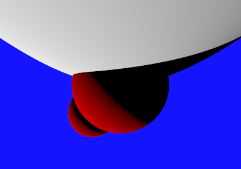

# Aufgabe 5: Reflexion


## 5.1: Material

neues Interface Material:

```java
public interface Material {

    public Color colorFor(final Hit hit, final Group group, final Tracer tracer);

    public Color getAmbient(final Hit hit, final Group group)  ;
}
```

neue abstrakte Klasse Scattered:

```java
public abstract class Scattered implements Material {
	
	// abstract method only for SingleColorMaterial
	 public abstract Color getColor();

    public abstract Color colorFor(final Hit hit, final Group group, final Tracer tracer);

    public Color getAmbient(final Hit hit, final Group group)   {
        final Point3 hitPoint = hit.ray.at(hit.t);
        final int samples = 32;
        double ambientDiv = 0;
        Ray ray;
        Hit ambientHit;
        final Vec3 normalVector = hit.normal.asVector();
        final Vec3 reverseHitRay = hit.ray.d.multi(-1);
        for (int i = 1; i <= samples; i++) {
            ray = new Ray(hitPoint, normalVector.multi(samples / 2 - i).add(reverseHitRay).normalized());

            ambientHit = group.hit(ray);
            if (ambientHit != null && ambientHit.t <= 1.0) {
                ambientDiv++;
            }
        }
        final Color ca;
        if (ambientDiv > 0) {
            ca = group.ambientLight.mul((1 - (ambientDiv / samples)));
        } else {
            ca = group.ambientLight;
        }

        return ca;
    }
}
```


### 5.2: Umbauarbeiten

Die Klassen Light und DirectionalLight wurden implementiert. DirectionalLight erbt von Light und erzeugt ein Licht in eine bestimmte Richtung.

### 5.3: Rekursive Strahlverfolgung 

Die Methode fr() in der neue Klasse Tracer, sorgt für eine rekursive Strahlenverfolgung. Sie gibt die Farbe des Materials des getroffenen Shape - Objektes zurück.


### 5.4: Perfekt Diffuses Material


## Bild



Die Methode colorFor() berechnet die Farbe des Lambert - Materials abhängig vom Hit - Objekt des gegebenen Group - Objektes. 

```java
`@Override
	public Color colorFor(final Hit hit, final Group group, final Tracer t) {
		final Point3 hitPoint = hit.ray.at(hit.t);
		final Color ca = getAmbient(hit, group);
		// System.out.println(ca.toString());
		Color cdca = ca.mul(color);
		final Normal3 n = hit.normal;

		Color cl;
		for (Light light : group.lightlist) {
			cl = light.color; // light color

			if (light.illuminates(hitPoint, group)) {

				final Vec3 l = light.directionFrom(hitPoint).normalized(); // l
																			// =
																			// light
																			// vector
				final double luminance = n.dot(l);
				final double max = Math.max(0, luminance);
				cdca = cdca.add(color.mul(cl).mul(max));
			}
		}
		// System.out.println(cdca);
		return cdca;
	}

```

### 5.* Zusatz: Reflective Material

Die Methode colorFor() berechnet die Farbe des Reflective - Materials abhängig vom Hit - Objekt des gegebenen Group - Objektes. 

```java
@Override
	public Color colorFor(Hit hit, Group group, Tracer tracer) {
		 final Color colAmbientLight = getAmbient(hit, group); //color ambient light
	        Color col = diffuse.mul(colAmbientLight); //cd * ca = col

	        final Vec3 e = (hit.ray.d.multi(-1)).normalized();
	        final Normal3 n = hit.normal; //normal vector
	        final Point3 hitPoint = hit.ray.at(hit.t);
	        final double cosValue = n.dot(e) * 2;

	        for (final Light light : group.lightlist) {

	            if (light.illuminates(hitPoint, group)) {
	                final Vec3 l = light.directionFrom(hitPoint).normalized();
	                final Vec3 r = l.reflectedOn(hit.normal);

	                final double max0NdotL = Math.max(0.0, l.dot(n));
	                final double max0EdotR = Math.pow(Math.max(0.0, r.dot(e)), exponent);
	                col = col.add(light.color.mul(diffuse).mul(max0NdotL)).add(light.color.mul(specular).mul(max0EdotR));
	            }
	        }
	        final Ray r = new Ray(hitPoint, hit.ray.d.add(hit.normal.mul(cosValue)));
	        final Color reflectedColor = tracer.fr(r);
	        return col.add(reflection.mul((reflectedColor)));
	    }
 
```


## Quellen

- Skripte Computergrafik I (Winter 2016)
- http://www.cs.cornell.edu/courses/cs4620/2011fa/lectures/08raytracingWeb.pdf
