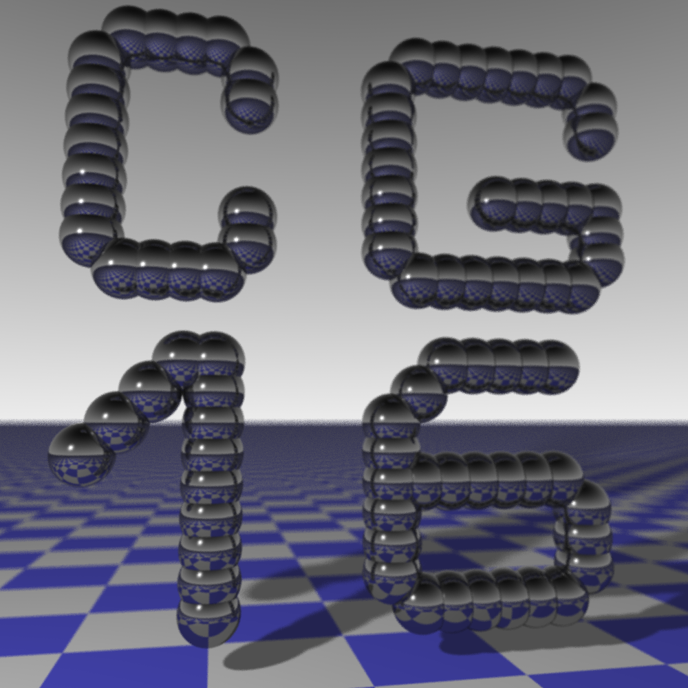
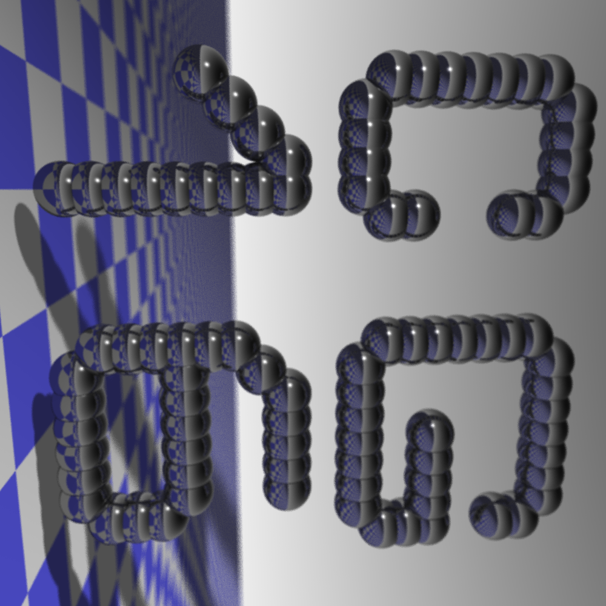
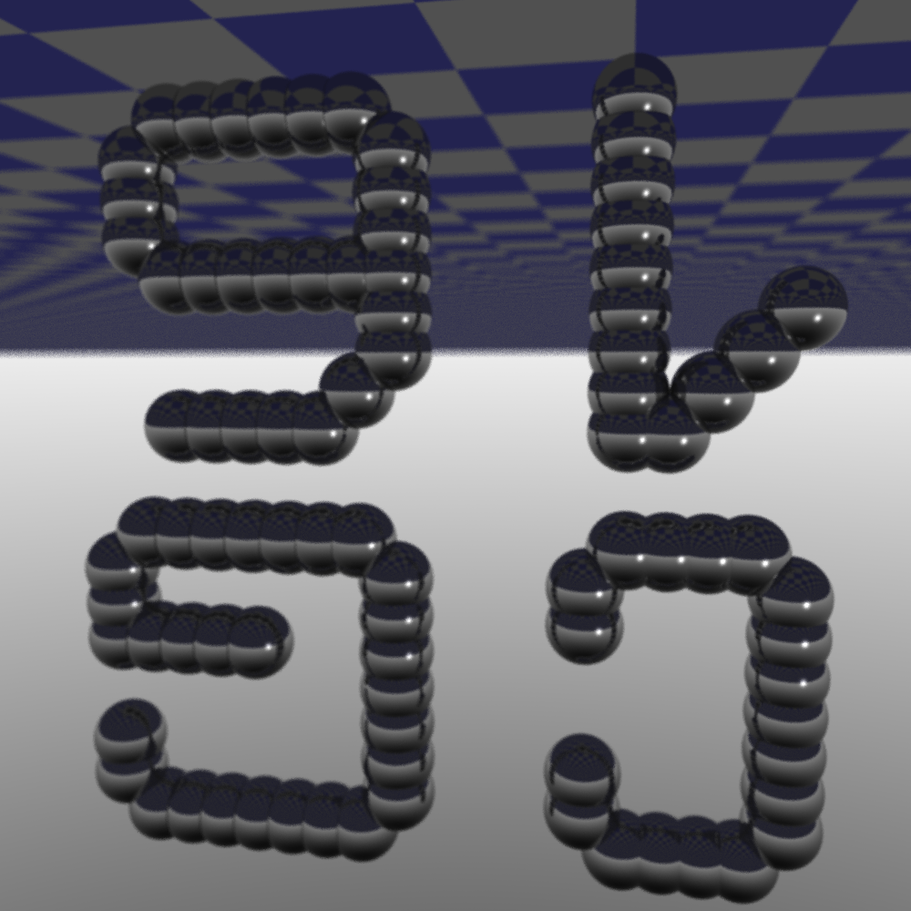
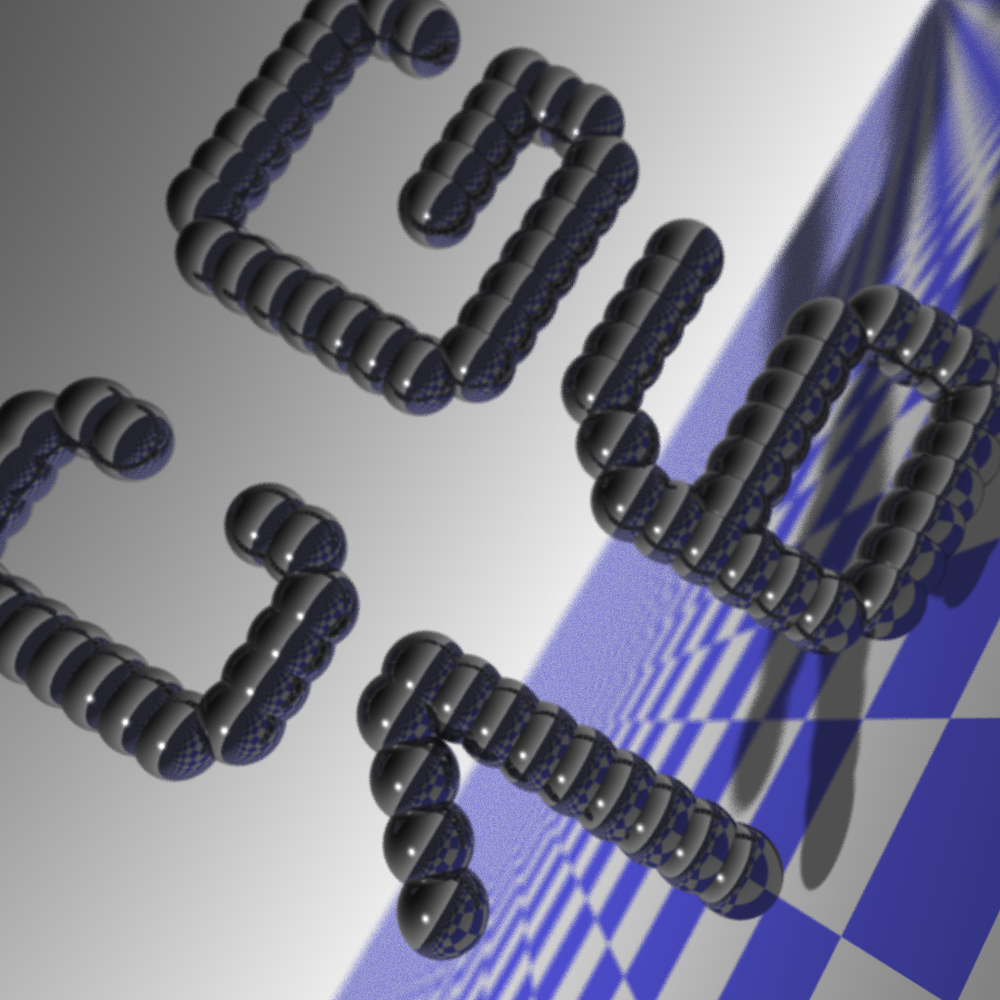

# Aufgabe 6: Bewegliche Kamera


## Bilder










### 6.2: Ansichten

RayTracer:

```java
public final class RayTracer {

    private final static char[][] art = {
        "  1111      1111111 ".toCharArray(),
        " 1    1    1       1".toCharArray(),
        " 1    1    1       1".toCharArray(),
        " 1         1        ".toCharArray(),
        " 1         1        ".toCharArray(),
        " 1         1   11111".toCharArray(),
        " 1    1    1       1".toCharArray(),
        " 1    1    1       1".toCharArray(),
        "  1111      1111111 ".toCharArray(),
        "                    ".toCharArray(),
        "                    ".toCharArray(),
        "    11       11111  ".toCharArray(),
        "   1 1      1       ".toCharArray(),
        "  1  1     1        ".toCharArray(),
        " 1   1     1        ".toCharArray(),
        "     1     1111111  ".toCharArray(),
        "     1     1      1 ".toCharArray(),
        "     1     1      1 ".toCharArray(),
        "     1     1      1 ".toCharArray(),
        "     1      111111  ".toCharArray()
    };

    static private Vec3[] build() {
        final Vector<Vec3> tmp = new Vector<>(art.length * art[0].length);

        final int nr = art.length;
        for (int j = 0; j < nr; j++) {
            final int nc = art[j].length;
            for (int k = 0; k < nc; k++) {
                if (art[j][k] != ' ') {
                    tmp.add(new Vec3(k, 6.5f, -(nr - j) - 1.0f));
                }
            }
        }

        return tmp.toArray(new Vec3[0]);
    }

```


## Quellen

- Skripte Computergrafik I (Winter 2016)
- http://fabiensanglard.net/rayTracing_back_of_business_card/index.php
