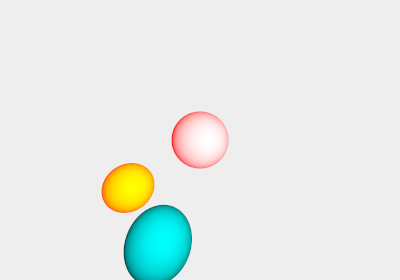
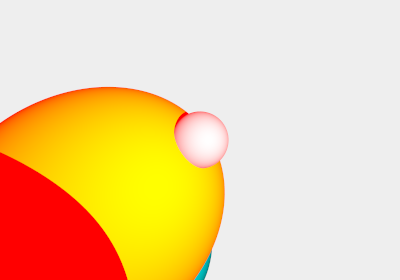
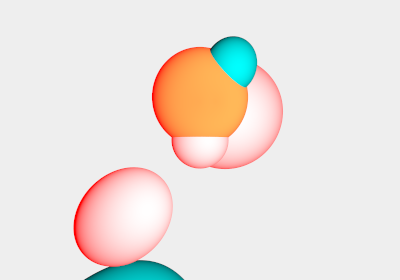

# Aufgabe 10: Licht und Schatten  Computergrafik I (WS16)


## Aufgabe 10.1: Punktlichtquellen

Die neue Klasse PointLight, welche von Light erbt, wurde implementiert. In der Methode illumates() wird überprüft, ob der gegebene Punkt vom Licht angestrahlt wird.

```java

@Override
    public boolean illuminates(final Point3 point, final Group world) {
        if (world == null) {
            throw new IllegalArgumentException("Group can't be null!");
        }
        if (point == null) {
            throw new IllegalArgumentException("Point can't be null!");
        }
        if (castsShadow == true) {
            Ray r = new Ray(point, directionFrom(point));

            if (world.hit(r) == null) {
                return true;
            }
            double t = r.tOf(position);
            return world.hit(r).t >= t;
        }
        return true;
    }


```

In der neuen Methode directionFrom() wird der Richtungsvektor von einem gegebenen Punkt zur Lichtquelle berechnet.

```java
    @Override
    public Vec3 directionFrom(final Point3 point) {
        return position.sub(point).normalized();
    }

```

In der Klasse Tracer kann somit die


### Aufgabe 10.2: Ansichten einer Szene









## Quellen

- Computergrafik I Skripte (WS16)
