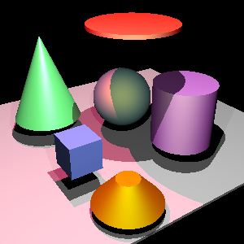

# Bonusaufgabe 1 - Zylinder und Kegel  


.

## Bild




## Lösung

Zylinder:

Der Kern der Lösung in der neu implementierten Klasse Cylinder.

```java
/**
	/**
	 * Tests this shape for hit with ray. If an hit is found
	 * record is filled out with the information about the hit and the
	 * method returns true. It returns false otherwise and the information in
	 * outRecord is not modified.
	 *
	 * @param outRecord the output hitRecord
	 * @param ray the ray to intersect
	 * @return true if the shape intersects the ray
	 */
	public boolean hit(Hit outRecord, Ray rayIn) {
	  Vec3 eminusc = new Vec3();
		eminusc.sub(rayIn.origin, center);
		
		double a = Math.pow(rayIn.direction.x, 2) + Math.pow(rayIn.direction.y, 2);
		double b = 2 * (rayIn.direction.x * eminusc.x + rayIn.direction.y * eminusc.y);
		double c = Math.pow(eminusc.x, 2) + Math.pow(eminusc.y, 2) - Math.pow(radius, 2);
		double discriminant = b * b - 4 * a * c;
		if (discriminant < 0) {
			return false;
		}
		
		double t1 = Math.min((-b + Math.sqrt(discriminant)) / (2 * a), (-b - Math.sqrt(discriminant)) / (2 * a));
    double t2 = (height / 2.0 - eminusc.z) / rayIn.direction.z;
    double t3 = (-height / 2.0 - eminusc.z) / rayIn.direction.z;
    
    // We'll iterate through the values in sorted order so we find closest hit first
    double[] tarr = {t1, t2, t3};
    Arrays.sort(tarr);
    
    Double t = null;                 // The lowest hit we find
    for (double x : tarr) {
      Hit tmp = new Hit();
      tmp.location.add(rayIn.origin, Vec3.getScaledVector(rayIn.direction, x));
      
      if (x == t1) {
        if (Math.abs(tmp.location.z - center.z) < height / 2.0) {
          outRecord.normal.set(
              tmp.location.x - center.x, 
              tmp.location.y - center.y,
              0);
          outRecord.normal.normalize();
          t = x;
          break;
        }
      } else {
        if (Math.pow(tmp.location.x - center.x, 2)
            + Math.pow(tmp.location.y - center.y, 2) 
            - Math.pow(radius, 2) <= 0) {
          if (x == t2) {
            outRecord.normal.set(0, 0, 1);
          } else if (x == t3) {
            outRecord.normal.set(0, 0, -1);
          }
          
          t = x;
          break;
        }
      }
    }
    
    if (t == null || t > rayIn.end || t < rayIn.start) {
      return false;
    }
		rayIn.end = t;
        outRecord.surface = this;
		outRecord.t = t;
		outRecord.location.add(rayIn.origin, Vec3.getScaledVector(rayIn.direction, t));
		return true;
	}

```

Kegel:

Der Kern der Lösung in der neu implementierten Klasse Cone
```java
/**
	 * Tests this shape for hit with ray. If an hit is found
	 * record is filled out with the information about the hit and the
	 * method returns true. It returns false otherwise and the information in
	 * outRecord is not modified.
	 *
	 * @param outRecord the output hitRecord
	 * @param ray the ray to intersect
	 * @return true if the shape intersects the ray
	 */
	public boolean hit(Hit outRecord, Ray rayIn) {
		Vec3 eminusc = new Vec3();
		eminusc.sub(rayIn.origin, center);
		
		double H = tipz - center.z;
		double R = radius;
		double s = Math.pow(R, 2) / Math.pow(H,  2);
			
		double a = Math.pow(rayIn.direction.x, 2) + Math.pow(rayIn.direction.y, 2) - s * Math.pow(rayIn.direction.z, 2);
		double b = 2 * (rayIn.direction.x * eminusc.x + rayIn.direction.y * eminusc.y - s * (eminusc.z - H) * rayIn.direction.z);
		double c = Math.pow(eminusc.x, 2) + Math.pow(eminusc.y, 2) - s * Math.pow(eminusc.z - H, 2);
		double discriminant = b * b - 4 * a * c;
		if (discriminant < 0) {
			return false;
		}
		
		double t1a = (-b + Math.sqrt(discriminant)) / (2 * a);
		double t1b = (-b - Math.sqrt(discriminant)) / (2 * a);
		double t2 = (height / 2.0 - eminusc.z) / rayIn.direction.z;
		double t3 = (-height / 2.0 - eminusc.z) / rayIn.direction.z;
		
		eminusc = null;
	    
	  // We'll iterate through the values in sorted order so we find closest hit first
	  double[] tarr = {t1a, t1b, t2, t3};
	  Arrays.sort(tarr);
	  
	  Double t = null;                 // The lowest hit we find
	  for (double x : tarr) {
	    Hit tmp = new Hit();
	    tmp.location.add(rayIn.origin, Vec3.getScaledVector(rayIn.direction, x));
	    
	    if (x == t1a || x == t1b) {
	      if (Math.abs(tmp.location.z - center.z) < height / 2) {
	        outRecord.normal.set(tmp.location.x - center.x, tmp.location.y - center.y, 0);
	        outRecord.normal.normalize();
	        outRecord.normal.add(0, 0, R / H);
	        outRecord.normal.normalize();
	        t = x;
	        break;
	      }
	    } else if (x == t2) {
	      if (Math.pow(tmp.location.x - center.x, 2) + Math.pow(tmp.location.y - center.y, 2) - Math.pow((R / H) * (H - height / 2), 2) <= 0) {
	        outRecord.normal.set(0, 0, 1);
	        t = x;
	        break;
	      }
	    } else if (x == t3) {
	      if (Math.pow(tmp.location.x - center.x, 2) + Math.pow(tmp.location.y - center.y, 2) - Math.pow((R / H) * (H + height / 2), 2) <= 0) {
	        outRecord.normal.set(0, 0, -1);
	        t = x;
	        break;
	      }
	    }
	  }
	  
	  if (t == null || t > rayIn.end || t < rayIn.start) {
	    return false;
	  }
	  rayIn.end = t;
	  outRecord.surface = this;
	  outRecord.t = t;
	  outRecord.location.add(rayIn.origin, Vec3.getScaledVector(rayIn.direction, t));
	  return true;
	}

```


## Quellen

--https://www.c-plusplus.net/forum/178915-full
