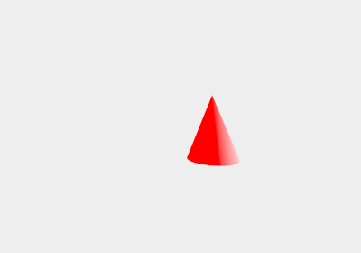
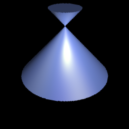
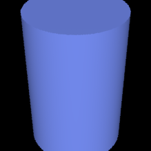
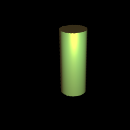
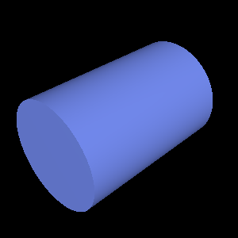

# Bonusaufgabe 1 - Zylinder und Kegel  


## Kegel







## Lösung

Eine neue Klasse [Cone](src/Kevin832924/b01/Shape/Cone.java ), welche von [Shape](src/Kevin832924/b01/Shape/Shape.java ) erbt, wurde implementiert. Jeder Kegel erhält folgende Attribute:

- Vec3 top         - Vektor, der aud die Spitze des Kegels zeigt
- double height    - Höhe des Kegels
- double bottomRad - Radius der Grundfläche ( Kreis )
- Scattered m      - Material

In der Methode hit() wird berechnet, ob der Kegel, abhhängig vom gegebenen [Ray](src/Kevin832924/b01/Raytracer/Ray.java ), getroffen wurde, oder nicht. (siehe code snippet)

```java
@Override
	public Hit hit (Ray ray) {
		
		// calculate r^2/h^2
		double rh = bottomRadius/height;
		rh *= rh;
		
		double a = ray.d.x * ray.d.x
				 + ray.d.z * ray.d.z
				 - ray.d.y * ray.d.y * rh;
		
		double b = 2 * ray.d.x * (ray.o.x - top.x)
				 + 2 * ray.d.z * (ray.o.z - top.z)
				 - 2 * ray.d.y * (ray.o.y - top.y) * rh;
		
		Point3 ot = ray.o.sub(top);
		double cyh = (height + top.y);
		cyh *= cyh;
		
		double c = ot.x*ot.x + ot.z*ot.z - (ot.y*ot.y) * rh;
		
		double solutions[] = SolveQuadrEq(a, b, c);

		for (double s : solutions) {
			if (s > 0) {
				Point3 intPos = ray.o.add(ray.d.multi(s));
				
				if (intPos.y > top.y || intPos.y < top.y - height)
					continue;

				float normalY = (float) (bottomRadius / Math.sqrt(bottomRadius*bottomRadius + height*height));

				Point3 normal = intPos.sub(top);
				normal.y = 0;
				Vec3 normale = new Vec3(normal.x,normal.y,normal.z);
				normale.normalized();
				normale = normale.multi(Math.sqrt(1-normalY*normalY));
				normale.y = normalY;

				// negate normal if ray hits the cone from inside to outside
				if (normale.dot(ray.d) > 0)
					normale = normale.multi(-1);
				return new Hit(s,ray,this, new Normal3 (normal.x,normal.y,normal.z));
			}
		}
		
		return null;
	}
```


## Zylinder








## Lösung

Eine neue Klasse [Cylinder](src/Kevin832924/b01/Shape/Cylinder.java ), welche von [Shape](src/Kevin832924/b01/Shape/Shape.java ) erbt, wurde implementiert. Jeder [Zylinder](src/Kevin832924/b01/Shape/Cylinder.java ) erhält folgende Attribute:

- Vec3 top         - Vektor, der die Position des Zylinders angibt
- double height    - Höhe des Zylinders
- double bottomRad - Radius der Kreisflächen
- Scattered m      - Material

In der Methode hit() wird berechnet, ob der Zylinder, abhängig vom gegebenen Ray, getroffen wurde, oder nicht. (siehe code snippet)

````java
  @Override
    public Hit hit(Ray ray) {

        // calculate r^2/h^2
        double a = ray.d.x * ray.d.x
                + ray.d.z * ray.d.z;

        double b = 2 * ray.d.x * (ray.o.x - top.x)
                + 2 * ray.d.z * (ray.o.z - top.z);

        Point3 ot = ray.o.sub(top);

        double c = ot.x * ot.x + ot.z * ot.z - bottomRadius * bottomRadius;

        double solutions[] = MathHelper.solveQuadrEq(a, b, c);


        Point3 normal = null;
        double distance = Double.MAX_VALUE;

        for (double s : solutions) {
            if (s > 0) {
                Point3 intPos = ray.o.add(ray.d.multi(s));

                if (intPos.y > top.y || intPos.y < top.y - height) {
                    continue;
                }

                distance = s;
                

                normal = intPos.sub(top);
                normal.y = 0;
                normal_new = new Vec3(normal.x,normal.y,normal.z);
                normal_new.normalized();
                d= s;
                // negate normal if ray hits the cylinder from inside to outside
                if (normal_new.dot(ray.d) > 0) {
                    normal_new = normal_new.multi(-1);
                }
                break;
            }
        }
        // a ray parallel to the xz-plane can not intersect top or bottom
        if (ray.d.y != 0) {
            // intersect with ground plane
            double t = (top.y - ray.o.y) / ray.d.y;
            // if farer away than shortest distance
            if (t > 0 && t < distance) {
                Point3 pos = ray.d.multi(t).add(ray.o);
                // test if Hit is within cylinder radius
                if (Math.pow(pos.x - top.x, 2) + Math.pow(pos.z - top.z, 2) < bottomRadius * bottomRadius) {
                    distance = t;
                    normal_new = new Vec3(0, 1, 0);
                }
            }
            // intersect with top plane
            t = (top.y - height - ray.o.y) / ray.d.y;
            // if farer away than shortest distance
            if (t > 0 && t < distance) {
                Point3 pos = ray.d.multi(t).add(ray.o);
                // test if Hit is within cylinder radius
                if (Math.pow(pos.x - top.x, 2) + Math.pow(pos.z - top.z, 2) < bottomRadius * bottomRadius) {
                    distance = t;
                    normal_new = new Vec3(0, -1, 0);
                }
            }
        }
        // if no Hit found, return null
        if (normal_new == null) {
            return null;
        } else {
            //Point3 intPos = ray.o.add(ray.d.multi(distance));
            return new Hit(distance,ray, this, new Normal3(normal_new.x,normal_new.y,normal_new.z));
        }
}


```


## Quellen

- https://www.c-plusplus.net/forum/178915-full
- http://mrl.nyu.edu/~dzorin/rend05/lecture2.pdf
- http://web.cse.ohio-state.edu/~hwshen/681/Site/Slides_files/basic_algo.pdf
