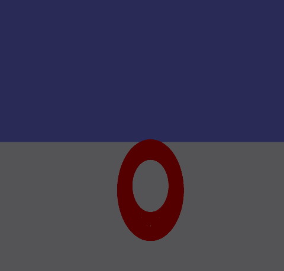
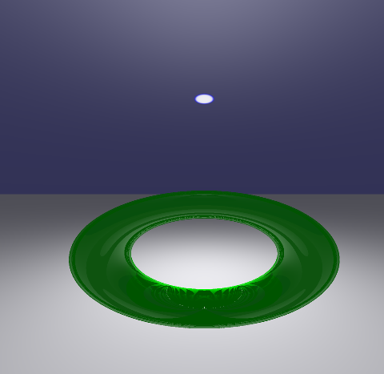
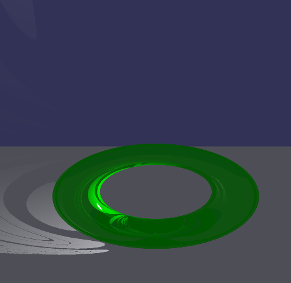
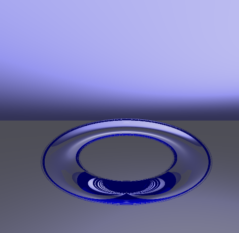

# Bonusaufgabe 2 - Torus


## Bilder










### 5.4: Lösung

Eine neue Klasse [Torus](src/Kevin832924/b01/Shape/Torus.java ), welche von der Klasse [Shape](src/Kevin832924/b01/Shape/Shape.java ) erbt. Jeder Torus erhählt folgende Attribute:

- double innerRadius, outerRadius - innerer und äußerer Radius
- Vec3 position                   - Position des Torus
- Color color                     - Farbe
- Scattered m                     - Material

In der Methode hit() wird, abhängig vom gegebenen [Ray](src/Kevin832924/b01/Raytracer/Ray.java ), berechnet, ob der Torus getroffen wurde, oder nicht. (siehe code snippet)

```java

   @Override
	public Hit hit(Ray ray) {
        double R = outerRadius;
        double r = innerRadius;
        Vec3 d = ray.d;
        Vec3 p = new Vec3(ray.o.x,ray.o.y,ray.o.z);

        double alpha = d.dot(d);
        double beta = 2* p.dot(d);
        double gamma = p.dot(p) - r * r - R * R;

        Polynomial polynomial = new Polynomial (
                gamma*gamma + 4*R*R*p.x*p.x - 4*R*R*r*r,
                2*beta*gamma + 8*R*R*p.x*d.x, // Oh..
                beta*beta + 2*alpha*gamma + 4*R*R*d.x*d.x, 
                2*alpha*beta,
                alpha*alpha 
        ); 

        Set<Double> solutions = polynomial.solve();
        if (solutions.size() == 0) {
            return null;
        }
        
        Point3 closestIntersection = null;
        double smallestDistance = Double.POSITIVE_INFINITY;
        double distance = 0;
        for (Double t: solutions) {
            Point3 intersectionPoint = ray.o.add(ray.d.multi(t));
           distance = ray.o.distanceTo(intersectionPoint);
            if (distance < smallestDistance) {
                smallestDistance = distance;
                closestIntersection = intersectionPoint;
               //System.out.println (closestIntersection.toString()); 
               
            }
          distance =  t; 
        }
        if(closestIntersection==null)
        	return null;

        return new Hit(distance,ray,this,localNormal(closestIntersection)) ;
    }

```


## Quellen

- Skripte Computergrafik I (Winter 2016)
- https://de.wikipedia.org/wiki/Torus
- http://mathematik-online.de/F36.htm
