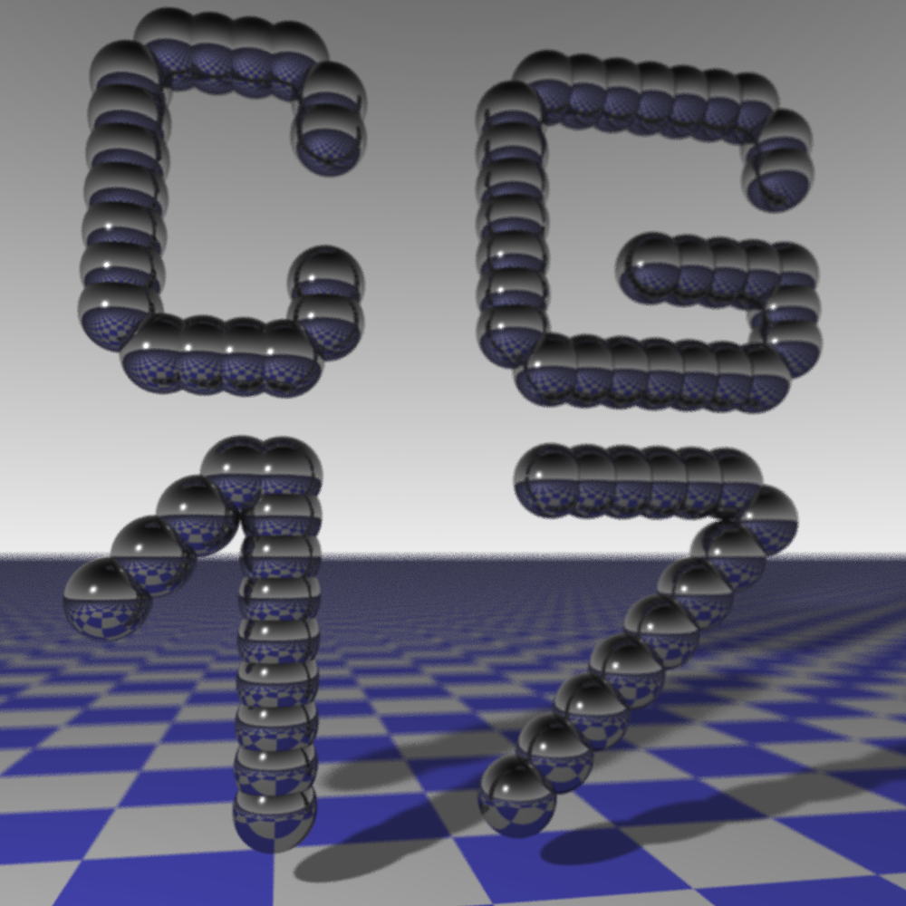

# Bonusaufgabe 3 - Parallelisierung

## Bild

Erzeugung des Bildes mit 2 Threads:

Erzeugung des Bildes mit 4 Threads:

Starting render#1 of size 1.00 MP (1000x1000) with 4 threads... 
Completed in 110385 ms
time for rendering: 110385 ms

