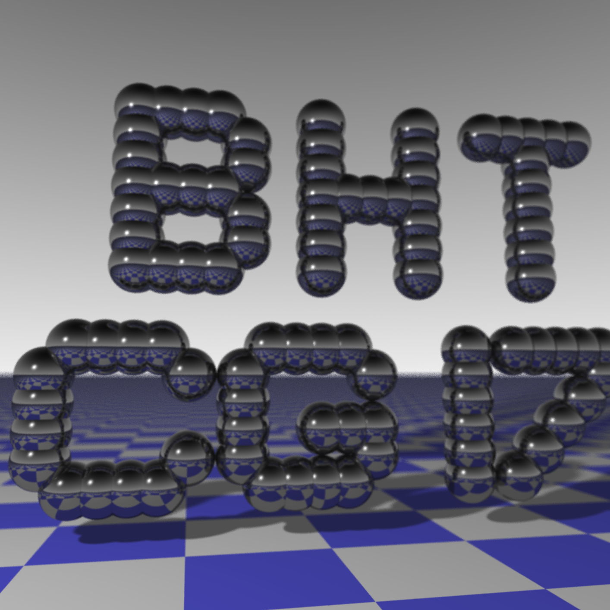

# Computergrafik I

## Raytracer - Rendering Competition

## Alle Lösungen

Hier steht eine Liste aller abgegebenen Lösungen.

- [Aufgabe 1:  Rote Scheibe auf Blau](doc/a01.md)
- [Aufgabe 2:  Viele Scheiben](doc/a02.md)
- [Aufgabe 3:  Gestreifter Himmel](doc/a03.md)
- [Aufgabe 4:  Unbeleuchteter Planet](doc/a04.md)
- [Aufgabe 5:  Beleuchteter Planet](doc/a05.md)
- [Aufgabe 6:  Bewegliche Kamera](doc/a06.md)
- [Aufgabe 10: Licht und Schatten](doc/a10.md)
 
- [Bonusaufgabe 1 - Zylinder und Kegel](doc/b01.md)
- [Bonusaufgabe 2 - Torus](doc/b02.md)
- [Bonusaufgabe 3 - Parallelisierung](doc/b03.md)
- [Bonusaufgabe 4- Street View Photo Sphere Kamera](doc/b04.md)

## finaler Raytracer

 
